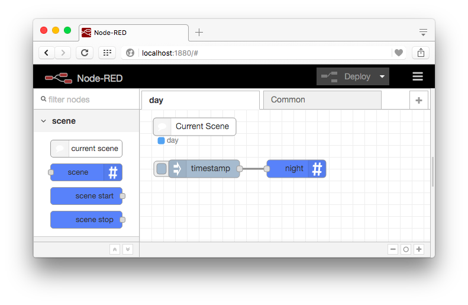
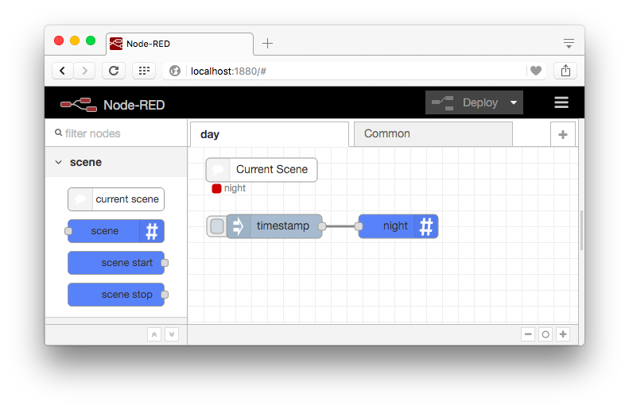

# node-red-contrib-scenes

Scenes for Node RED.

[](https://travis-ci.org/denwilliams/node-red-contrib-scenes)

## What Is This?

A modification for Node RED that adds "scene" support.

A "scene" is a typical set of Node RED tabs, each with their own set of flows.
Changing scenes essentially allows you to stop a set of rules (flows) and replace
them with another "scene" set.

I originally wrote (hacked) this a couple of years ago when Node RED was quite
new for [homenet](https://github.com/denwilliams/homenet-core). It actually turned
out to be the most valuable part of homenet so it made sense to separate it out
into its own component. The Node RED internals aren't the easiest to reverse engineer
and pretty scarce on comments, though there website actually has a few docs on
interfaces now. Re-implementing using Typescript makes it easy to check the custom
implementations match the documented interfaces.

## How Does It All Work?

The modification adds 4 new node types:

The `current-scene` node simply indicates if the scene that is loaded in the web
UI is the same scene. When the scene changes it is not possible to refresh the UI
automatically. This node indicates when it has changed.

When the scene is the same as the loaded scene the status indicator is blue:



When the scene is different than the loaded scene the status indicator is red and indicates the actual scene.
When this happens you need to refresh the browser:



The `scene` node changes the scene to something different.

The `scene-start` node is triggered after the scene has been loaded and started.

The `scene-stop` node is triggered before the scene is stopped in preparation for loading the next scene.

## Common (Shared) Tabs

The provided scene manager and storage have a concept of shared or "common" tabs.
These tabs will be available on *every* scene.

To create a shared tab, when you create a new tab prefix it with `common`. By default
when a new scene is created there is always a shared tab called `Common` and a
new tab named the same as the scene. Any tab that is *not* prefixed with `common`
will not be shared.

## Use

```js
var RED = require('node-red');
var nrScenes = require('node-red-contrib-scenes');
nrScenes.start(RED, {port:1880});
```

To run from the command line use https://github.com/denwilliams/node-red-contrib-scenes-exec

## [Documentation](http://www.denwilliams.net/node-red-contrib-scenes/0.1.5/)
